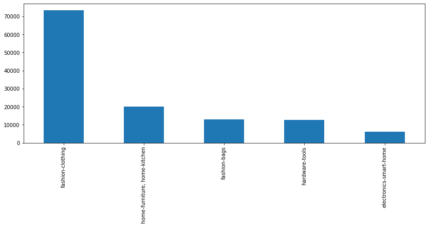

product_classification
-------


<!-- TABLE OF CONTENTS -->
## Table of Contents

* [About the Project](#about-the-project)
* [Getting Started](#getting-started)
  * [Installation](#installation)
* [Usage](#usage)
* [Contact](#contact)


<!-- ABOUT THE PROJECT -->
## About The Project

This is my solution to Zip Co Limited Data Science challenge test.

The test aims to implement a model to identify the categories/collection of products based on the features of the products that they have from the crawling data.

More descriptions and requirements about the test can be found [here](./URG-DataScientist-TechnicalChallenge-181121-0045.pdf) 

<!-- GETTING STARTED -->
## Getting Started
### Installation

- Clone the repository by running command:
```sh
git clone https://github.com/transferhp/zip_product_classification.git
```

- Create a virtual environment and go to the root directory of project to run:
```sh
pip install -r requirements.txt
```
to install the required dependencies;

## Solution walkthrough
Before running any data analysis or prediction, it is always important to understand the data first. Given our goal is to build a classifier to predict which category a product should belong to, a lot of product relevant information is provided, like product name, text description and pictures etc. 

### Preprocess
For simplicity, I focus on using only name and description as inputs for building the classifier. To prepare the text data for the model building, text processing is needed to conduct as it is the very first step for any NLP projects. Some classical preprocessing steps are:

* Remove punctuations, like . , ! $( ) * % @
* Remove number
* Remove stop words
* Lower case
* tokenization
* stemming
* lemmatization

Let's start by reading the data. Without loading everything to explode memory, I choose to read the data from zip file line by line and only process what is needed and save it into a dictionary.

```python
import zipfile
import json

def load_raw_data(file_path):
    data = {"id": [], "name": [], "desc": [], "cat0": [], "cat1": [], "cat2": []}

    with zipfile.ZipFile(f"{file_path}") as z:
        with z.open("exercise3.jl") as f:
            for line in f:
                product_info = json.loads(line.strip())
                data["id"].append(product_info["_id"])
                if "product_name" in product_info["_source"]:
                    data["name"].append(
                        text_processing(product_info["_source"]["product_name"])
                    )
                else:
                    data["name"].append("")
                if "long_description" in product_info["_source"]:
                    data["desc"].append(
                        text_processing(product_info["_source"]["long_description"])
                    )
                else:
                    data["desc"].append("")

                cat0 = ", ".join(product_info["_source"]["e_cat_l0"]).lower()
                cat1 = ", ".join(product_info["_source"]["e_cat_l1"]).lower()
                cat2 = ", ".join(product_info["_source"]["e_cat_l2"]).lower()
                data["cat0"].append(cat0)
                data["cat1"].append(cat1)
                data["cat2"].append(cat2)

        print("Logging Info - Data Size:", len(data["id"]))
        assert (
            len(data["id"])
            == len(data["name"])
            == len(data["desc"])
            == len(data["cat0"])
            == len(data["cat1"])
            == len(data["cat2"])
        )
        return data
``` 

During processing, I have run all listed above steps to clean the text data. More details can be found in following used functions.
```python
def stemming_words(words):
    stemmer = PorterStemmer()
    return [stemmer.stem(word) for word in words]


def lemmatize_words(words):
    lemmatizer = WordNetLemmatizer()
    return [lemmatizer.lemmatize(word) for word in words]


def text_processing(input_str):
    # Lowercase
    input_str = input_str.lower()
    # Remove numbers
    clean_str = re.sub(r"\d+", "", input_str)
    # Remove special symbols
    clean_str = re.sub(r"\W+", " ", clean_str)
    # Remove punctuation
    clean_str = clean_str.translate(str.maketrans("", "", string.punctuation))
    # Tokenize words
    list_words = word_tokenize(clean_str)
    # Remove stop words
    list_words = [word for word in list_words if word not in stopwords.words("english")]
    # Stem
    list_words = stemming_words(list_words)
    # Lem
    list_words = lemmatize_words(list_words)
    return " ".join(list_words)
```
Notebook that contains all the preprocessing steps can be found [here](./notebooks/data_processing_initial_EDA.ipynb)


### EDA
After cleaning all the data, I converted the dictionary into a Pandas DataFrame to assist initial exploratory data analysis. The cleaned data has 125344 rows and 8 columns. 

First step is to check missing values in each column. There is no NaN value in our data as we are handling text data, but it is necessary to check empty string in each column by
```python
cleaned_df.replace('', np.nan).isnull().sum()
```


Due to the nature of craweling data, it is expected to see empty or blank for name or description about a product.

Then I check the distribution of product category at different level.

<center>Product category distribution at level 0</center>


<center>Product category distribution at level 1</center>



<center>Product category distribution at level 2 (Generated by internal REGEX classifier)</center>


From the distribution plot, we can easily find that **fasion** is the largest category in the data, which will also add difficulty to the modelling as the dataset is unbalanced.

Besides category distribution, I also checked the word length of product name and description.


It turns out that for most of products in the crawled data we generally don't have a long text associated though we combined both name and original long description together.


Notebook with all data analysis can be found [here](./notebooks/data_processing_initial_EDA.ipynb)


## Dimension Reduction and visualisation
It is always helpful to visualize the high-dimensional data before applying machine learning models. In our case, to extract information from raw text data, I apply TF-IDF (Term Frequency - Inverse Dense Frequency) technique to vectorize the preprocessed corpus of the dataset to extract a vocabulary and create the feature matrix. The feature matrix is pretty sparse considering all the distinct words we may get from original product description. We can transform and reduce our input feature space through the Principal Component Analysis (PCA). In terms of handling a sparse matrix, I use TruncatedSVD instead.

Putting the Tf-Idf vectorizer and the PCA in a pipeline allows us to transform and reduce dimension of raw text data in just one step. I try with 50 components in my solution as a start.
```python
pca_pipeline = Pipeline([
    ('vect', TfidfVectorizer(ngram_range=(1,3), stop_words='english', 
                             sublinear_tf=True, max_features=50000, min_df=2)),
    ('pca', TruncatedSVD(n_components=50, random_state=123))
])

pca_50 = pca_pipeline.fit_transform(df['name_desc'])
```
Each component extracted by the decomposition will express a given amount of the variance of our data. In the best case, all the variance is expressed by a low number of new features. PCA performs the decomposition and maps the input data to the new vector space.
```python
pca_50 = pca_pipeline.fit_transform(df['name_desc'])

print('Cumulative explained variation for 50 principal components: {}'.format(np.sum(pca_pipeline.named_steps["pca"].explained_variance_ratio_)))
```
```sh
Cumulative explained variation for 50 principal components: 0.13667637036453745
```
Now, lets see if the first three components are enough to visually set the different data points apart. I create a 3D scatterplot of the first three principal components and color each of the different types of categories with a different color. 


From above plots, it is clearly not enough to set all of categories apart. Next I explore t-SNE (t-Distributed Stochastic Neighbouring Entities) as another alternative to reduce dimension.
```python
# Apply T-SNE on PCA output
tsne_model = TSNE(n_components=2, perplexity=50, n_iter=300, n_jobs=4, verbose=1)
tsne_results = tsne_model.fit_transform(pca_50)
```
Now that we have the resulting dimensions we can again visualise them by creating a scatter plot of the two dimensions and coloring each sample by its respective category label.


There is a significant improvement over PCA, we can see that products are clearly clustered within in their sub-groups when tagged by category level 0 (root category) and level 1 (child of root category). However, it seems some product groups are hard to separate with category level 2 (category produced by internal REGEX classifier), which definitely means that some improvements can be made there.

Notebook that shows dimension reduction and visualization can be found [here](./notebooks/Visualisation_PCA_TSNE.ipynb)

## Modelling and evaluation
Through above visual results, it shows possibility to build a supervised machine learning classifier to predict product category. To this end, I explore word level features (handled by TF-IDF vectorizer) and multinomial logistic regression classifier to construct our baseline model.
```python
# build a pipeline 
pipeline = Pipeline([('vect', TfidfVectorizer(ngram_range=(1,3), stop_words='english', 
                                              sublinear_tf=True, max_features=50000, min_df=2)),
                     ('clf', LogisticRegression(C=1e2, n_jobs=4, solver='lbfgs', 
                                                random_state=17, verbose=0, 
                                                multi_class='multinomial',
                                                fit_intercept=True))
                    ])
```
For the training data, product long descriptions are fit and transformed by the pipeline, while for the label, I use flat structure by joining level0, level1 and level2 with '|'.
```python
pipeline.fit(train_df['desc'], train_df['cat0_cat1_cat2'])
``` 
```sh
Pipeline(steps=[('vect',
                 TfidfVectorizer(max_features=50000, min_df=2,
                                 ngram_range=(1, 3), stop_words='english',
                                 sublinear_tf=True)),
                ('clf',
                 LogisticRegression(C=100.0, multi_class='multinomial',
                                    n_jobs=4, random_state=17))])
```

Once the model is trained, we can test it on the hold-out dataset (test data, which never been seen by the model to evaluate its generality)
```python
pred_level_3 = pipeline.predict(test_df['desc'])
```
The prediction for level0, level1 and level2 can be further derived by
```python
pred_level_0 = [el.split('|')[0] for el in pred_level_3]
pred_level_1 = [el.split('|')[1] for el in pred_level_3]
pred_level_2 = [el.split('|')[2] for el in pred_level_3]
```

Metrics like precision, recall or F1-score can summarize the model quality. Following shows results of evaluting model performance at different category level.

```python
print(classification_report(
    y_true=test_df['cat0'], 
    y_pred=pred_level_0,
    digits=4)
)
```
```sh
              precision    recall  f1-score   support

 electronics     0.9734    0.9686    0.9710      1211
     fashion     0.9971    0.9985    0.9978     17303
    hardware     0.9880    0.9821    0.9850      2509
        home     0.9871    0.9862    0.9866      4046

    accuracy                         0.9934     25069
   macro avg     0.9864    0.9838    0.9851     25069
weighted avg     0.9934    0.9934    0.9934     25069
```
```python
print(classification_report(
    y_true=test_df['cat1'], 
    y_pred=pred_level_1,
    digits=4)
)
```
```sh
                              precision    recall  f1-score   support

      electronics-smart-home     0.9734    0.9686    0.9710      1211
                fashion-bags     0.9977    0.9966    0.9971      2615
            fashion-clothing     0.9965    0.9984    0.9975     14688
              hardware-tools     0.9880    0.9821    0.9850      2509
home-furniture, home-kitchen     0.9871    0.9862    0.9866      4046

                    accuracy                         0.9932     25069
                   macro avg     0.9886    0.9864    0.9875     25069
                weighted avg     0.9932    0.9932    0.9932     25069
```

```python
print(classification_report(
    y_true=test_df['cat2'], 
    y_pred=pred_level_2,
    digits=4)
)
```

```sh
recall  f1-score   support

             electronics-smart-home-security-cameras-and-systems     0.9734    0.9686    0.9710      1211
                                 fashion-bags-laptop-tablet-bags     0.9977    0.9966    0.9971      2615
                            fashion-clothing-jumpsuits-playsuits     0.9482    0.9674    0.9577      3217
fashion-clothing-jumpsuits-playsuits, fashion-clothing-sleepwear     0.8378    0.5167    0.6392        60
     fashion-clothing-jumpsuits-playsuits, fashion-clothing-tops     0.8766    0.7584    0.8133       356
                                      fashion-clothing-maternity     0.9809    0.9764    0.9787      4746
              fashion-clothing-pants, fashion-clothing-sleepwear     0.8429    0.8365    0.8397       263
                                      fashion-clothing-sleepwear     0.9661    0.9754    0.9707      6046
                                      hardware-tools-power-tools     0.9880    0.9821    0.9850      2509
                   home-furniture-outdoor, home-kitchen-cookware     0.9871    0.9862    0.9866      4046

                                                        accuracy                         0.9732     25069
                                                       macro avg     0.9399    0.8964    0.9139     25069
                                                    weighted avg     0.9730    0.9732    0.9729     25069
```
Above results show that we can achieve pretty decent accuracy over 97%. Notebook to train and evaluate a baseline model can be found [here](./notebooks/baseline_desc_tfidf_lr.ipynb).

I also experiment with another improvement by training model with both product name and long descriptions. Results show that marginal improvement can be further achieved with this small change. More details can be found in this [notebook](./notebooks/name_desc_tfidf_lr.ipynb).

Besides checking those accuracy metrics, I also try to explore which words are more important in predicting different product categories, so that it will gave us more confidence and explainnations about how those predictions are made by the model. For example, checking contributions of different words in decision made by baseline model.
```python
eli5.show_weights(
    estimator=pipeline.named_steps['clf'],
    vec=pipeline.named_steps['vect'])
```
By looking at those top positive words, I feel they are quite supportive and fairly good for the model to make a dicision.

## Serving and inference
Once model is trained and we are happy with the results, next we may consider to deploy and serve the model. 

To this end, we need to save the model itself and corresponding transformers as well. As for us, it is much easier to save the whole sklearn pipeline by
```python
import joblib

joblib.dump(pipeline, 'baseline_model.joblib')
```
so that whenever we want to call the model to make a prediction, we can safely load back the whole consistent pipeline by
```python
pipeline = joblib.load("baseline_model.joblib")
```

In my solution I only care about implementing and testing POC, so not too many MLOps techiniqes are consider there. But for tracking and registering trained models and associated parameters, we can use `MLflow` as a good candidate tool if we want to productionize the models .

Simple example showing how inference is generated can be found [here](./notebooks/inference.ipynb)


<!-- CONTACT -->
## Contact
Author: [Peng Hao](haopengbuaa@gmail.com)

Project Link: [https://github.com/transferhp/zip_product_classification.git](https://github.com/transferhp/zip_product_classification.git)
